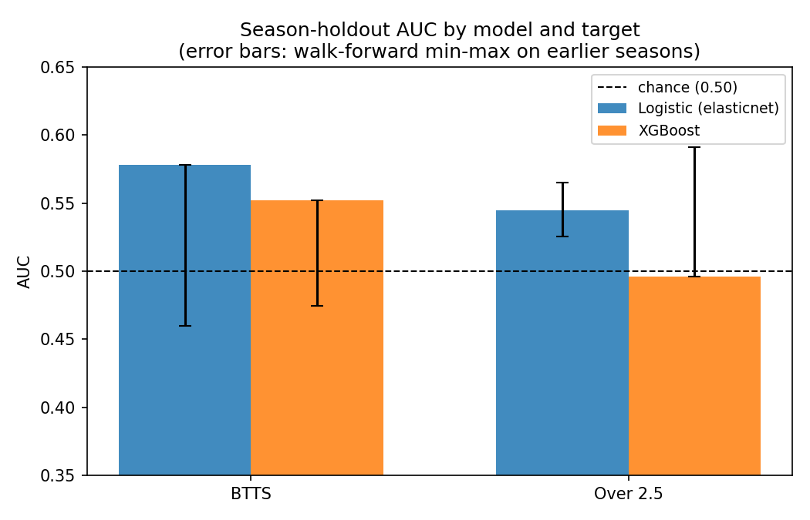
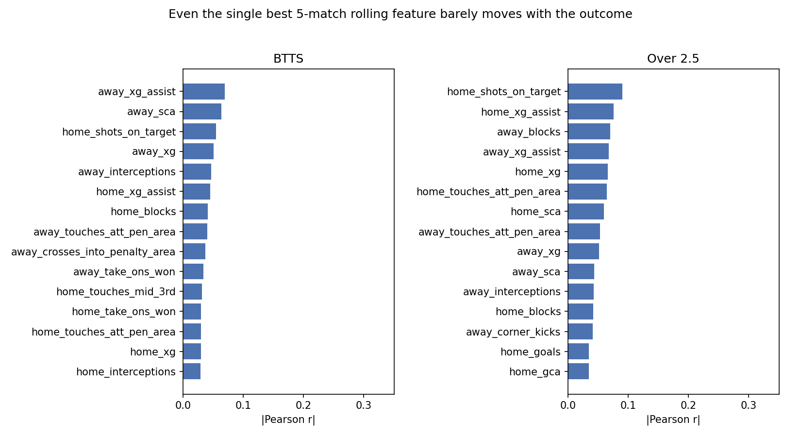

# Football Match Outcome Prediction: BTTS & Over 2.5 Goals

Predicting two match outcomes across eight European top-flight leagues -
both teams to score (BTTS) and total goals over 2.5 - from each team's
5-match rolling form, comparing an elasticnet logistic regression
against XGBoost. All data from FBref: 8,116 matches spanning the Premier
League, La Liga, Serie A, the Bundesliga, Ligue 1, the Eredivisie, the
Primeira Liga, and the Belgian Pro League, from the 2017-18 season
through 2024-25.

## What this is, honestly

Across the four model/target combinations, season-holdout AUC ranges
from 0.53 to 0.60 - modest, but consistently above chance (0.50), across
a much larger and more varied dataset than a single league would give.
No model dominates across the board: logistic regression is a little
ahead on BTTS, XGBoost is a little ahead on Over 2.5. Pre-match
team-form statistics carry real but weak signal for these two markets
once you evaluate honestly (out-of-sample, season holdout, no leakage),
which is broadly consistent with football being one of the harder
sports to beat a bookmaker's line on. The value of this project is the
methodology - a leak-free feature pipeline and a fair, apples-to-apples
backtest between two model families across eight leagues - not a claim
of a profitable prediction system.

## Results

The headline number for each model/target is a **season holdout**: the
most recent season (2024-25) is set aside before anything is fit, and is
never touched during training or calibration - only used once, at the
end, to score the model. Alongside it, a **walk-forward** check
(multiple rolling train/test windows, restricted to the earlier seasons
only) shows how much the result moves around with the split, since a
single holdout season is still just one sample.

| Model | Target | Season-holdout AUC | Brier | Walk-forward AUC (mean, min-max) |
|---|---|---|---|---|
| Logistic (elasticnet) | BTTS | 0.548 | 0.248 | 0.568 (0.561-0.572) |
| Logistic (elasticnet) | Over 2.5 | 0.588 | 0.244 | 0.600 (0.595-0.608) |
| XGBoost | BTTS | 0.526 | 0.250 | 0.535 (0.533-0.540) |
| XGBoost | Over 2.5 | 0.604 | 0.244 | 0.574 (0.558-0.585) |

For context, always predicting the base rate (~50-52%) gives a Brier
score of about 0.25 for a target this close to balanced - so on Brier
score, every model here is close to a coin flip, with logistic on BTTS
and both models on Over 2.5 edging slightly ahead of that baseline. The
season-holdout AUCs sit above 0.50 for all four model/target pairs, and
the walk-forward spread stays fairly tight and consistently above 0.50
across all three rolls for every combination - a modest but reasonably
stable edge over chance, not a fluke of one holdout season. Full
per-roll numbers are in `results/*.json`.



## Why the signal is this weak

It's tempting to blame the models, so it's worth checking the features
themselves before doing that. `analysis/plot_results.py` computes the
plain Pearson correlation between every one of the 38 rolling "combo"
features and each target, across all 8,116 matches in all eight
leagues - no model involved, just "does this number move with the
outcome at all":



The single most-correlated feature out of 38 reaches **r = 0.070**
(`away_xg_assist`) for BTTS and **r = 0.098**
(`home_touches_att_pen_area`) for Over 2.5. Most sit well under 0.05. A
model built on top of these can't be expected to separate classes much
better than chance, because the inputs themselves barely move with the
outcome - no amount of tuning, regularization, or a fancier model
changes that. This matches the wider pattern in football analytics: a
5-match rolling average of shots, xG, and possession stats describes a
team's recent *level*, not what happens in one specific match against
one specific opponent, and goals in football are low-frequency,
high-variance events that a lot of match-to-match noise (finishing
luck, a red card, a deflection) sits on top of. It's also the kind of
market bookmakers price efficiently precisely because pre-match
team-form stats are public and easy to compute - if this signal were
strong, it likely wouldn't still be sitting there unpriced. None of
that is a flaw in this pipeline; it's the actual finding, and it holds
across all eight leagues, not just one.

## Why these numbers should be trusted

This is a rewrite of an earlier, messier version of this project that
had three real methodology problems, since fixed:

1. **Inconsistent train/test splitting.** A few of the original model
   scripts used `sklearn.train_test_split` with a random shuffle on
   time-series match data, which lets information from nearby, feature-
   overlapping matches leak across the split and inflates apparent
   performance. Every script here uses date-ordered splits instead -
   train on an earlier block of matches, evaluate on strictly later
   ones.
2. **No real backtest.** The original "final" evaluation shuffled
   already-generated predictions into random buckets and reported
   precision on each - which is closer to describing sampling noise than
   measuring the model. This version reports AUC and Brier score
   instead, which is what actually tells you whether the model ranks
   matches better than chance and whether its probabilities are
   trustworthy.
3. **No held-out season.** The original splits were all internal to
   whatever data was loaded, with no season kept fully separate from
   training. This version adds a season-holdout split
   (`models/common.py::make_season_holdout_split`): the last season of
   each league is set aside before training starts and is only ever used
   once, to score the final model - the standard way to backtest a
   model that will actually be deployed one season ahead at a time.

The feature engineering itself (5-match trailing rolling medians,
`src/rolling.py`) was already correct in the original project: each
match's own result is excluded from its own rolling features by
construction (the window only looks at the `WINDOW` matches strictly
before the one being predicted), and the prediction targets never leak
into the feature set. That part carried over unchanged.

## Layout

```
run.py          One-command launcher: trains + evaluates both models on
                both targets and prints a summary table.
analysis/       plot_results.py builds the two figures in this README -
                the model comparison and the feature-correlation check.
scraper/        The original data-collection scripts (Selenium + BeautifulSoup
                against FBref). Not currently functional - see scraper/README.md.
data/           raw/ and match_lists/ - folder structure preserved with a
                few real sample files; processed/training_table.csv is the
                full real feature table. See data/README.md.
src/            Feature pipeline: FBref match JSON -> per-team match
                records -> 5-match rolling "combo" features -> one row
                per match in data/processed/training_table.csv. Discovers
                whatever league/season folders are present under
                data/raw/fbref/ - not hardcoded to one league.
models/         common.py has the shared season-holdout and walk-forward
                splits, metrics, and calibration helpers both models use.
                logistic.py and xgboost_model.py are the two trained
                models, evaluated identically.
results/        Per-model metrics (JSON) from the runs reported in this
                README - season-holdout result plus walk-forward rolls.
```

## Scope, and what's not included

- **All eight leagues that the loader discovers were actually trained
  on.** The loader (`src/build_dataset_by_matches.py`) discovers and
  reads any league/season folder present under `data/raw/fbref/`, and
  for this run that meant the Premier League, La Liga, Serie A, the
  Bundesliga, Ligue 1, the Eredivisie, the Primeira Liga, and the
  Belgian Pro League - 8,116 matches from 2017-18 through 2024-25 -
  rather than a single league.
- **The ~11 GB of raw scraped FBref match JSON is not included here** -
  the folder structure is preserved with a couple of real sample files
  (see `data/README.md`) plus the already-built `training_table.csv`,
  which is what both models actually train and evaluate on.
- **The scrapers in `scraper/` no longer work.** FBref changed its site
  after these were written, and the scrapers no longer pull complete
  data. They're included to show the actual data-collection pipeline
  behind this project, not as a ready-to-run tool - see `scraper/README.md`.
- WhoScored, FotMob, and ClubElo loaders existed in earlier iterations of
  this project but were never actually wired into the trained models, so
  they're left out of this version.

## Running it

```
pip install -r requirements.txt
python run.py
```

`run.py` trains and evaluates both models on both targets and prints a
summary table - the fastest way to reproduce the numbers in this README.
Each combination also writes its full per-roll detail to
`results/<model>_<target>.json`. To run one model/target on its own:

```
python models/logistic.py btts        # or: over25
python models/xgboost_model.py btts
```

To regenerate the two figures in this README from `results/*.json` and
`data/processed/training_table.csv`:

```
python analysis/plot_results.py
```

To rebuild `training_table.csv` itself from raw match JSON (only useful
if you have a fuller local copy of `data/raw/fbref/` than what ships
here):

```
python run.py --rebuild-data
```

Run against just the 2 sample files that ship in this repo, this
correctly produces zero rows and stops - the rolling-window feature
builder needs 5 prior matches per team before it will emit a row for
that team, which 2 sample matches can't provide. That's expected, not a
bug: it needs a fuller local `data/raw/fbref/` to produce real output.
